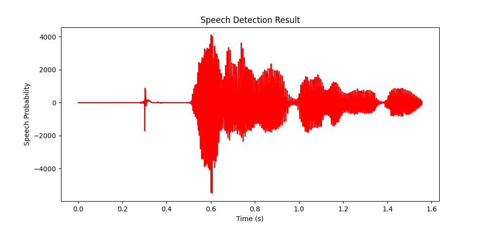

# Voice Activity Detection (VAD)

A lightweight, dependency-minimal Voice Activity Detection system built from scratch in Python. No pre-trained models — just signal processing fundamentals.

---

## How It Works

The pipeline processes audio in four stages:

1. **Reading** — Loads WAV files, converts stereo to mono, slices audio into 20ms frames
2. **Feature Extraction** — Computes RMS Energy and Zero-Crossing Rate (ZCR) per frame
3. **Detection** — Classifies each frame as `speech` or `silence` using energy/ZCR thresholds + sliding window smoothing
4. **Export** — Merges consecutive speech frames into segments, cuts them with `pydub`, and saves timestamps to CSV

---

## Visualization



Green regions indicate detected speech segments across the audio timeline.

---

## Project Structure

```
vad-project/
├── audio/              # Input WAV files
├── output/             # Exported segments
├── vad/
│   ├── reading.py      # WAV loading & framing
│   ├── features.py     # RMS Energy & ZCR extraction
│   ├── detector.py     # Threshold-based classification & smoothing
│   └── exporter.py     # Segment cutting
└── main.py             # CLI entrypoint
```

---

## Usage

```bash
pip install numpy scipy pydub matplotlib
python main.py --input audio/sound.wav --output output --threshold 200
```

| Argument | Description | Default |
|---|---|---|
| `--input` | Path to WAV file | required |
| `--output` | Output directory | `output` |
| `--threshold` | Energy threshold for speech detection | `200` |

---

## Dependencies

- `numpy` — Signal math
- `scipy` — Audio file I/O
- `pydub` — Audio segment cutting
- `matplotlib` — Waveform visualization

---

## What I Learned

- Frame-based audio analysis (windowing, sample rate, frame duration)
- Short-time Fourier Transform concepts via RMS energy calculation
- Zero-Crossing Rate as a noise discriminator
- Smoothing noisy binary signals with sliding window majority vote
- CLI design with `argparse`

---

## Author

[@firatmio](https://github.com/firatmio)
